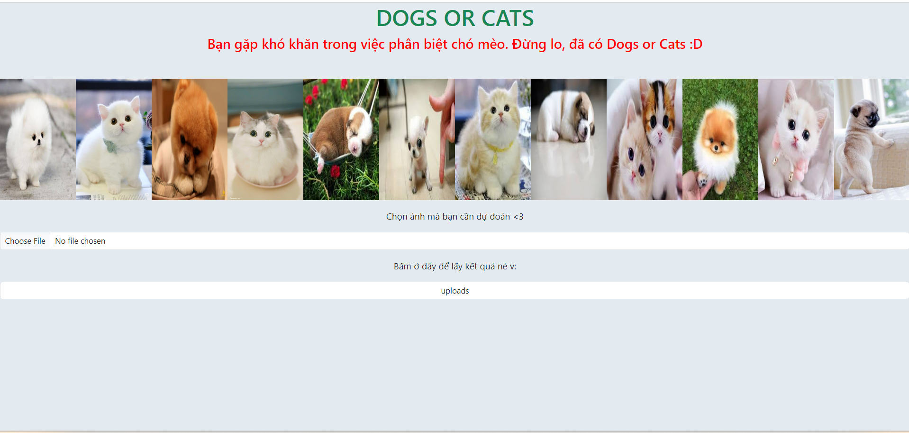
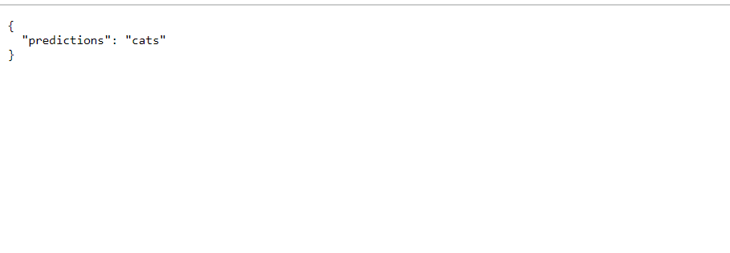
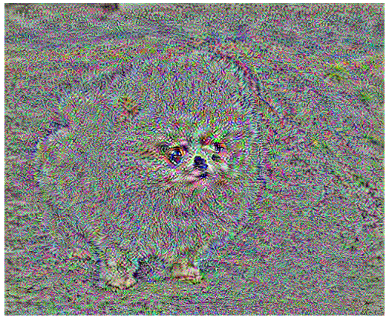
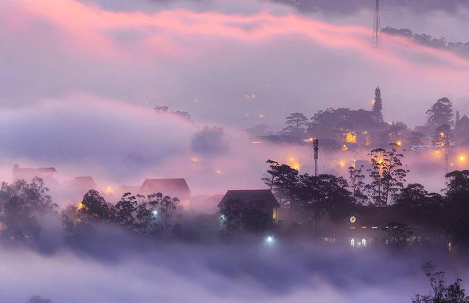
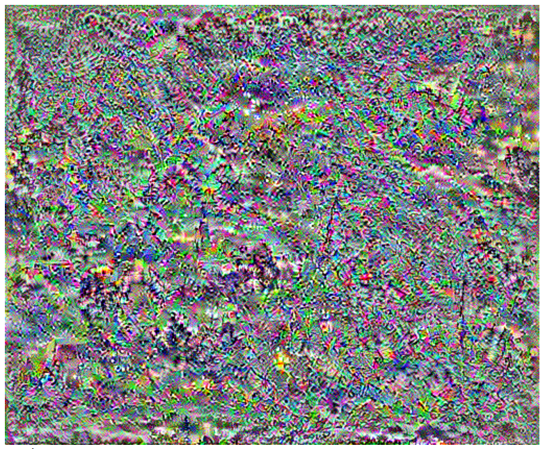
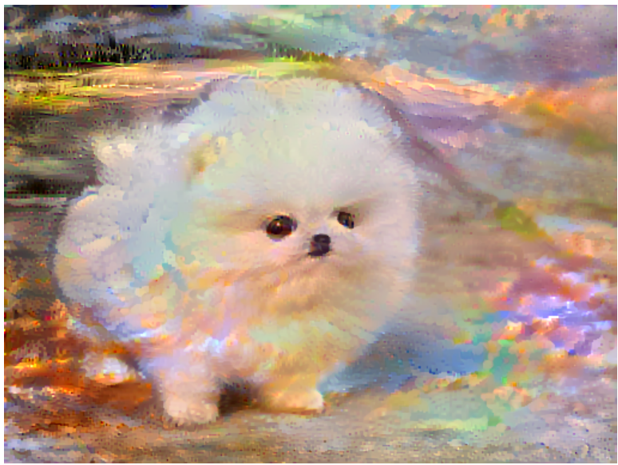

# Deep_learning
## Introduction
Here is my python source code for coding deeplearning based on several datasets as well as re-coding other insteresting projects. This reporsitory includes some small projects which it takes me about 2 weeks or more for each one.

#### First porject
I used to CNN of deeplearning to extract feature image based on fashion-mnist dataset and cifar-10. I also used keras tuner library to choose the best hyperparameters for model.

  
  
  

#### Second project
I re-coded nvidia's project which is  using CNN to predict driving angles based on steering car.

  
  
  

#### Third project
I used Alexnet and VGG16 model for tranfer learning, fine-tuning, train from scrath, using weight of alexnet as initial weight for dog and cat dataset and then I deployed on the website.

  
  <i>Return the result</i>
  
  

#### Fourth project
I implemented style tranfering.

  
   
  <i>These are content image and content loss image</i> 
  
   
  <i>These are style image and style loss image</i> 
  
   
  <i>These are final image and image after training with 1000 steps </i> 

