# Deep_learning
## Introduction
Here is my python source code for coding deeplearning based on several datasets as well as re-coding other insteresting projects. This reporsitory includes some small projects which it takes me about 2 weeks or more for each one.

#### First porject
I used to CNN of deeplearning to extract feature image based on fashion-mnist dataset.

  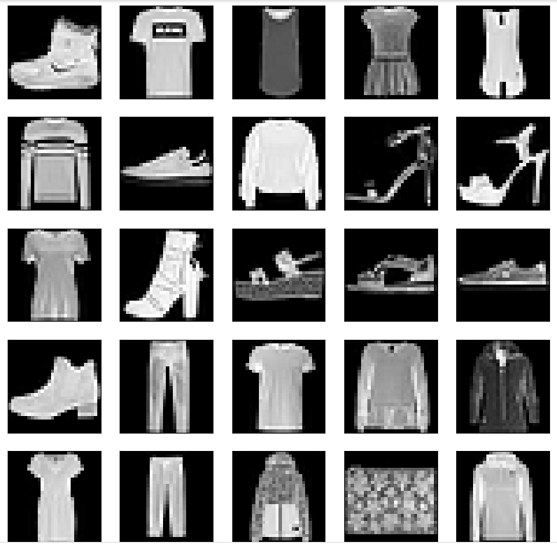
  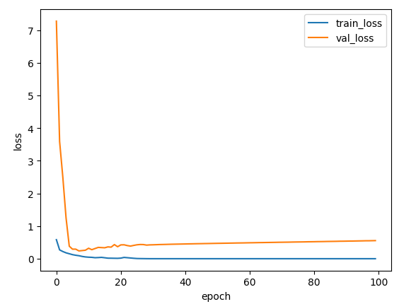
  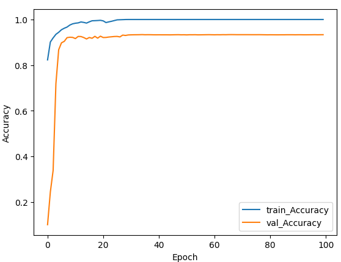

#### Second project
I re-coded nvidia's project which is  using CNN to predict driving angles based on steering car.

  
  
  

#### Third project
I using keras tunner to chose Hyperparameter for model which i built for cifar10 dataset

  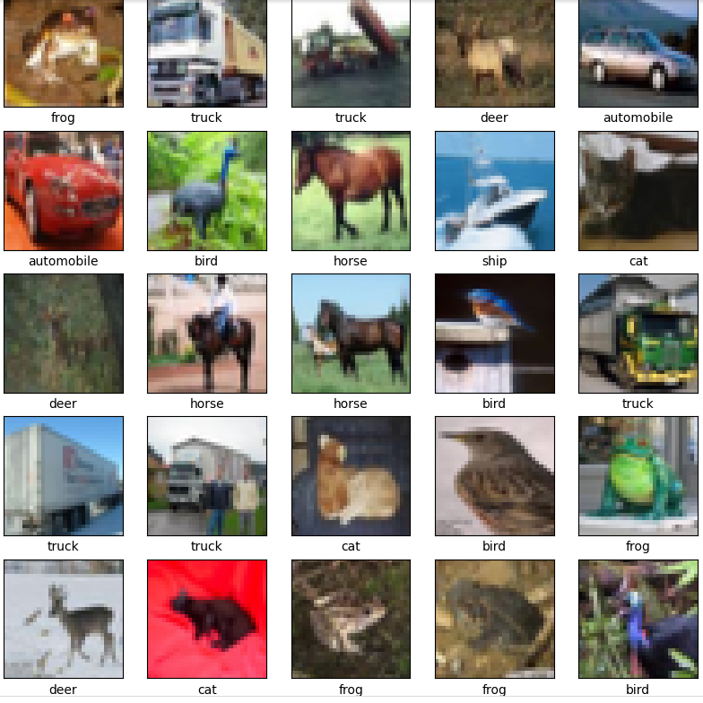
  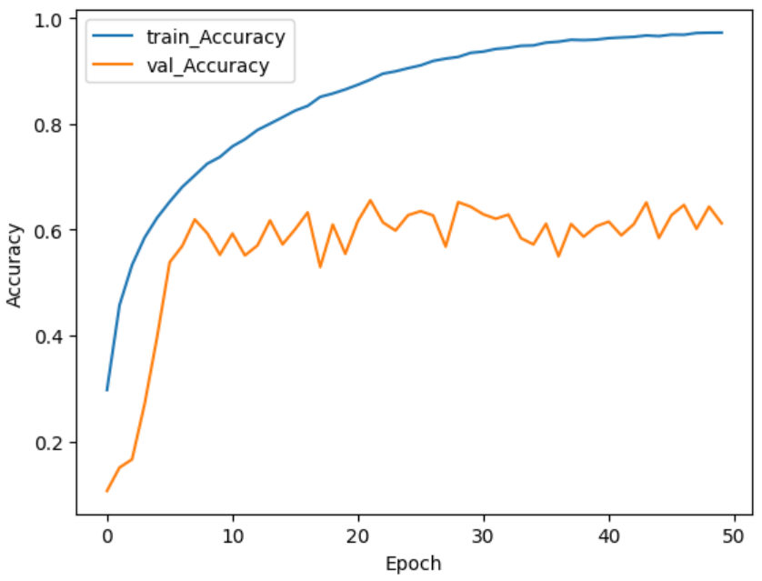
  <i>After choosing HP</i>
  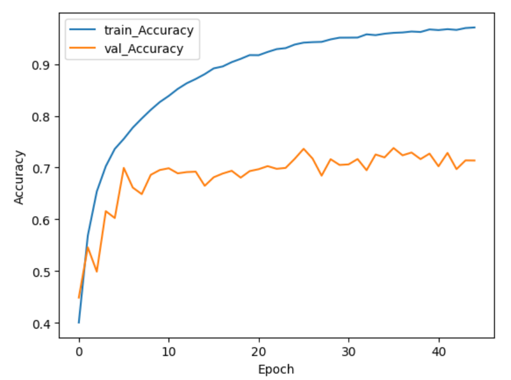

#### Fourth project
I used VGG16 model for tranfer learning, fine-tuning, train from scrath, using vgg16 weight as initial for dog and cat dataset

  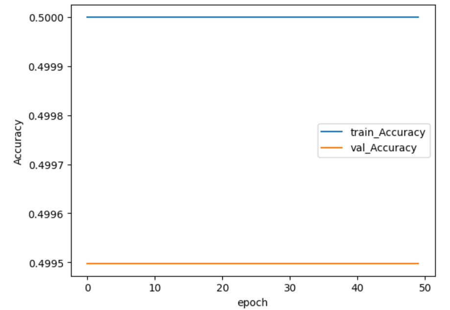
  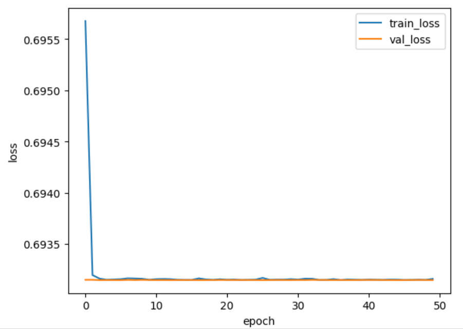
  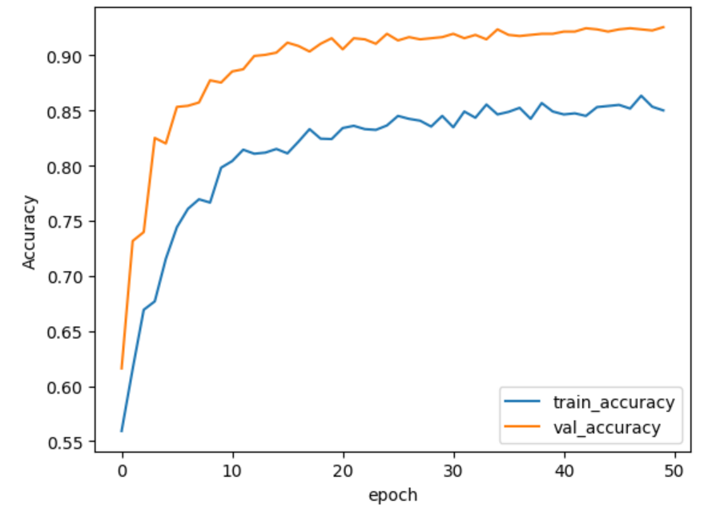
  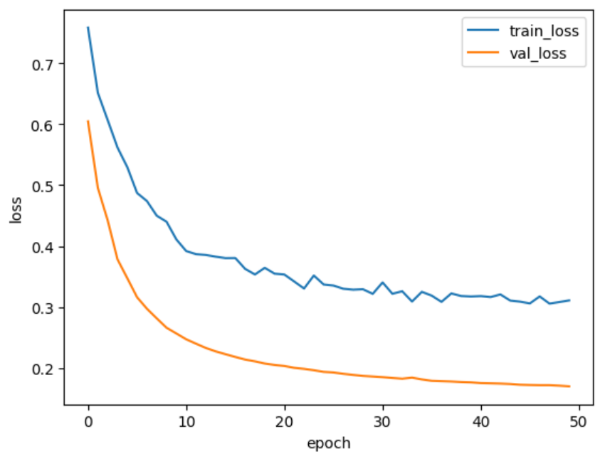 
   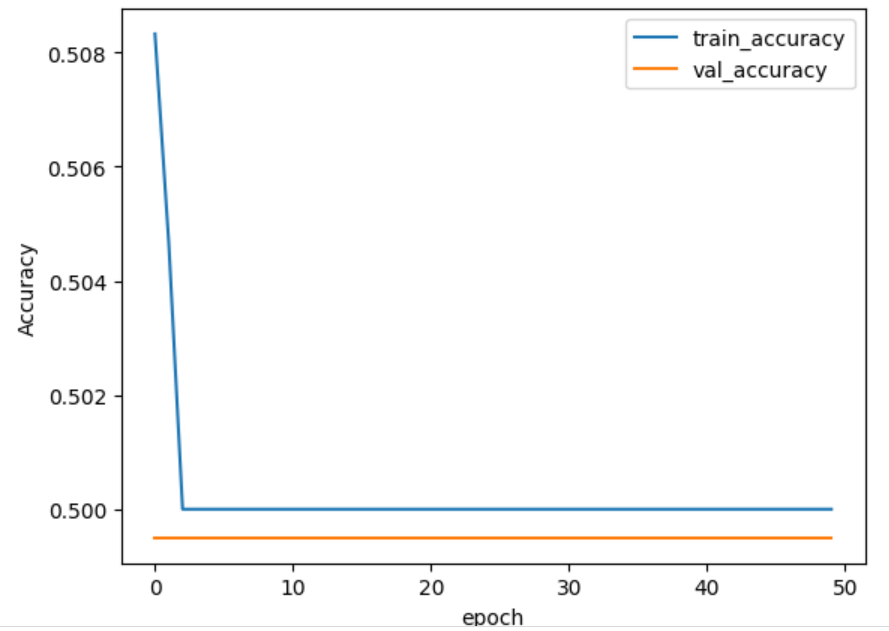
  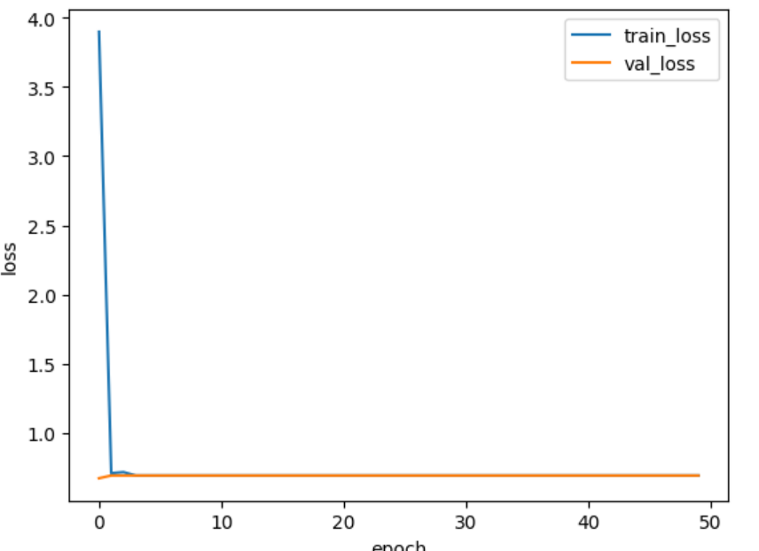
   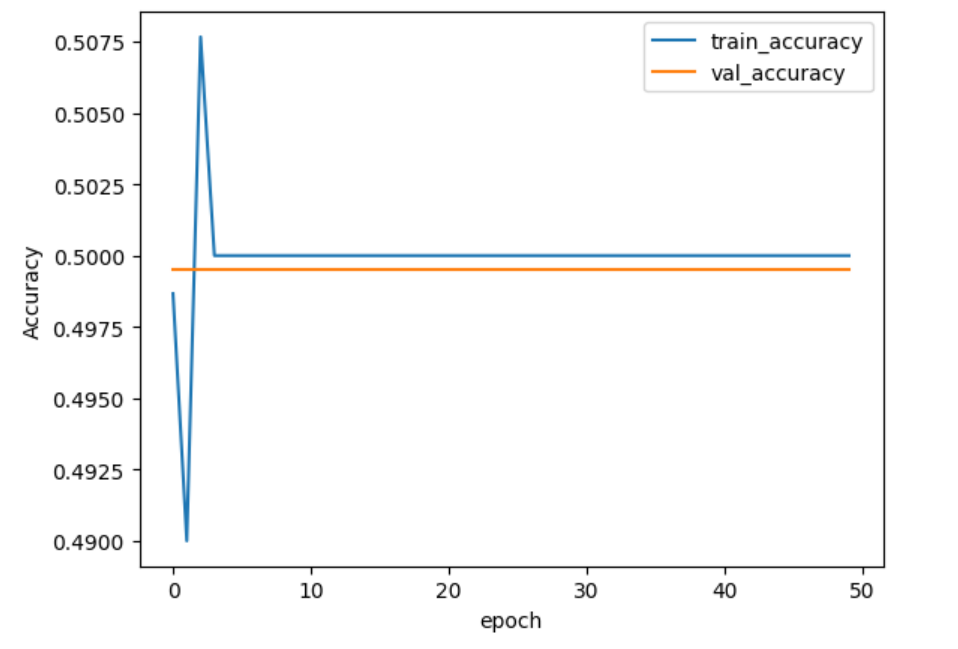
  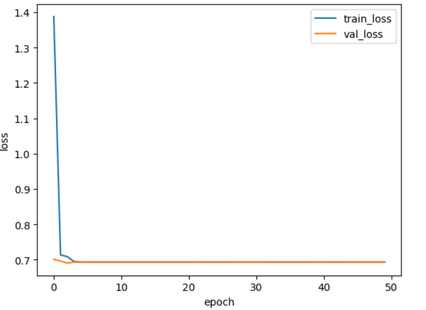

